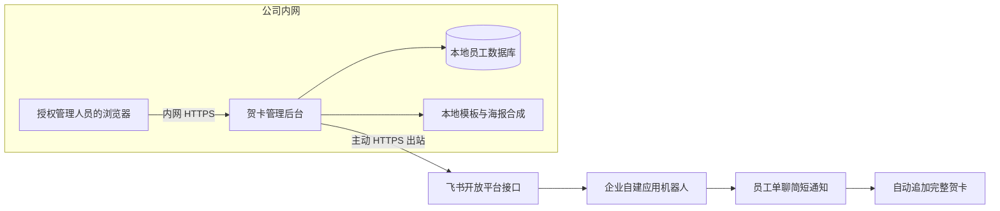

# 公司内网部署与数据边界

本项目按公司内网部署交付：在公司内部受控、持续开机的电脑或虚拟机上运行后台，管理人员通过内网地址操作。无需租用公网或云服务器，也无需将员工数据库上传到外部主机。这里的运行电脑承担后台服务功能；关闭服务或电脑休眠会停止自动推送。

## 访问和推送链路



- 后台主动读取应用已授权的通讯录，并主动上传海报、调用发送接口。当前流程不使用飞书回调，不需要将后台地址开放给飞书访问。
- 公司 IT 允许运行电脑主动访问 `https://open.feishu.cn` 的 HTTPS 接口；完全断网的内网无法使用当前方案同步通讯录或推送。由公司 IT 配置出站代理或域名放行，不使用内网穿透。
- 后台入口仅对公司允许的内网管理终端开放。不做公网端口映射、云端镜像或公开海报链接。公司外访问如有需求，由 IT 提供受控 VPN。
- 员工收到的海报已由后台上传到飞书，当前消息中的图片预览不依赖员工访问内网后台。

## 数据边界

| 数据 | 所在位置 / 去向 |
| --- | --- |
| 员工名单、生日、入职日期、部门及 open_id 对应关系 | 内网运行电脑的 `data/app.db`；由授权管理员维护 |
| 飞书 App Secret、管理口令 | 内网运行电脑本地 `.env`，不进入代码仓库；调用飞书认证时使用 App Secret |
| 模板、上传字体、底图、合成海报 | 内网运行电脑的项目文件夹及受控备份 |
| 推送记录和错误日志 | 内网运行电脑；按公司要求控制读取权限与保留时间 |
| 收件人 open_id、通知文案、最终海报 | 推送时发送至公司批准使用的飞书服务 |

“内网部署”不等于“所有信息均不离开内网”。当前完整卡片流程必须将最终海报上传到飞书；图片上出现的姓名、部门、周年数或日期也会随图片传输。完整员工数据库不会作为推送附件上传。

若公司规定连海报中的人员信息也不能传至飞书，应改用另一种交付方式：飞书只发送不含人员明细的通用通知与内网页面链接，员工在公司网络或 VPN 中登录后查看个人贺卡。该方式还需要员工登录、本人访问校验和员工页面，当前版本尚未实现。

当前生日和周年模板均关闭外部 AI 生图，海报在本地合成。交接时保持 `ai.enabled=false`，不要把含员工字段的提示词交给外部生图服务。

## 内网运行配置

建议由公司 IT 在内网配置 HTTPS 入口，转发到同一台电脑的后台回环地址。配置示意如下，真实口令和应用凭据由部署人员在内网电脑本地填写：

```dotenv
HOST=127.0.0.1
PORT=8848
ADMIN_TOKEN=在本机填写公司批准的管理口令
DRY_RUN=true
FEISHU_APP_ID=在本机填写应用ID
FEISHU_APP_SECRET=在本机填写应用密钥
```

以上为说明用占位文字，不可直接当作正式凭据。公司 HTTPS 入口应仅对获准管理终端开放，转发回环端口；不要公开绑定端口。

若 IT 选择直接绑定内网 IP，应把 `HOST` 设置为运行电脑实际的固定内网 IP，并通过主机防火墙限定访问来源。管理口令不能通过明文网络传输，正式管理仍应使用公司内网 HTTPS。非回环监听时，系统会拒绝以空管理口令启动。

配置管理口令后，员工 API 和海报文件均受访问控制。浏览器在成功访问管理 API 后取得一小时有效、仅用于海报目录的会话 Cookie；图片地址中不包含管理口令。名单和海报响应要求浏览器及代理不缓存。公司统一登录可以作为入口层的补充，当前应用内仍是共享管理口令，不具备独立管理员账号和个人权限分配。

内网运行电脑需要保持开机、避免休眠，并使用公司批准的进程管理方式开机启动和故障恢复。调度器运行一个后台实例。数据库和日志的磁盘权限、加密及备份位置由公司 IT 管理，备份也留在公司批准的范围内。

## 上线及日常操作

1. IT 确定运行电脑、固定内网地址、HTTPS 入口和可访问的管理终端，安装项目并配置本地凭据。
2. 保持演练模式，检查飞书连接并同步人员。当前应用尚缺 `contact:group:readonly`（获取用户组信息），需要授权开通并发布后才能完成完整通讯录检查。
3. 管理人员核对基础资料，补全生日，调整模板，扫描生成海报，再确认发送排期。
4. 使用明确授权的测试收件人验收。正式启用由负责人将 `DRY_RUN=false` 并重启，核对运行模式后执行自动推送。
5. 管理人员日常只打开公司内网后台；员工在飞书机器人会话接收简短通知和完整贺卡。

本次仅调整部署方案和访问保护。开发电脑仍通过 `http://127.0.0.1:8848/` 本机访问，保持演练模式；尚未配置公司的内网入口或开放网络端口。

接口依据：[飞书上传图片](https://open.feishu.cn/document/server-docs/im-v1/image/create)、[飞书发送消息](https://open.feishu.cn/document/server-docs/im-v1/message/create)。
